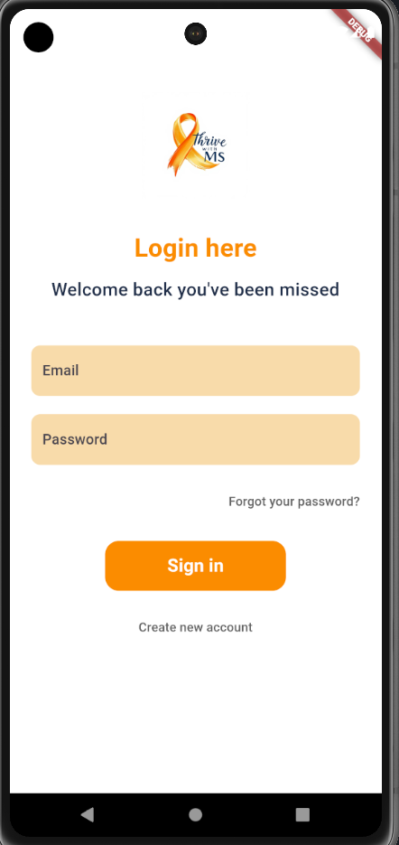
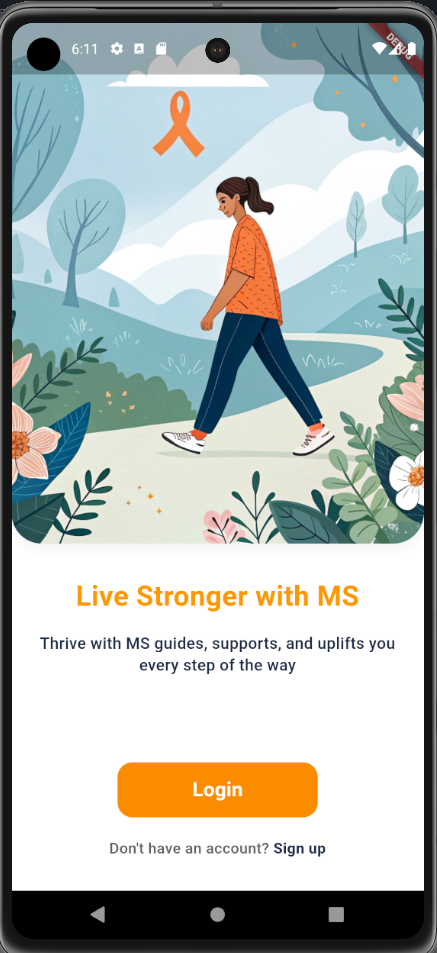
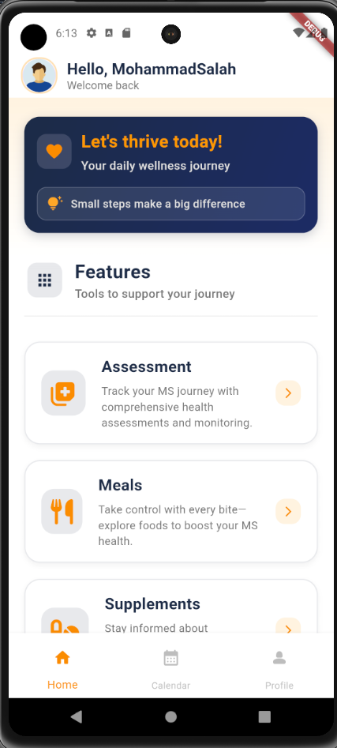

# Thrive With MS

**Thrive With MS** is a full-stack health tracking platform designed to support individuals with Multiple Sclerosis (MS) in managing symptoms, schedules, and overall well-being.

The project includes a mobile application for patients, a backend server for data management, and an admin dashboard for monitoring and control.

---

## Project Overview

The goal of this project is to provide a centralized and user-friendly system that helps users:
- Track health symptoms over time
- Manage daily activities and reminders
- Improve awareness and consistency in health monitoring

This project was developed as an **individual graduation project** and covers the complete software development lifecycle from planning to deployment-ready architecture.

---

## Technology Stack

### Mobile Application
- Flutter (Dart)
- Cross-platform support (Android & iOS)
- Clean UI and responsive design

### Backend
- Node.js
- Express.js
- MongoDB
- RESTful APIs
- Environment-based configuration

### Admin Dashboard
- JavaScript
- Web-based interface for data monitoring and management

---

##  Key Features

- User authentication and account management
- Health and symptom tracking
- Scheduling and reminders
- Secure backend communication
- Admin dashboard for system oversight
- Modular and scalable architecture

---

##  My Role

- Designed and developed the **entire system individually**
- Built the mobile application using Flutter
- Developed RESTful APIs and backend services
- Designed database schemas and data flow
- Implemented clean code practices and project structure
- Managed version control using Git and GitHub

---

## Screenshots

Below are some screenshots from the application:

## 📂 Project Structure

